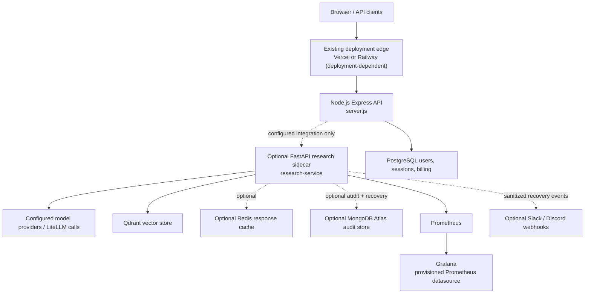

# BharatGPilot Architecture Blueprint

This diagram documents the **repository-backed topology**. Planned clients or services are labelled as planned rather than shown as deployed.

## Operational notes

- The main app is Node.js/Express; `research-service/` is a separate optional FastAPI sidecar. Do not assume the FastAPI service is the primary public gateway.
- Compose isolates the `monitoring` network and binds Prometheus/Grafana ports to loopback by default. Use an authenticated edge proxy or SSH tunnel for remote access.
- Grafana's datasource is provisioned from `grafana/provisioning/datasources/datasources.yml` and points to the Compose service name `prometheus:9090`. Keep the datasource UID stable to avoid dashboard reference drift.
- MongoDB audit storage, its health/recovery worker, and Slack/Discord alerts are optional and depend on private environment variables. Webhook delivery is best-effort, not a durable paging system.
- MongoDB backups are opt-in with the Compose `backup` profile and use a separate `MONGODB_BACKUP_URI`. Local backups alone are not an off-site disaster-recovery strategy; copy them to separately authenticated object storage and test restores before calling backups production-ready.
- A React/Next.js admin dashboard, a production Nginx sidecar, and a complete tenant billing reconciliation API are **not established in the current repository topology**. Do not route production traffic to those components until their app entry points, auth integration, health checks, and CI validation exist.
- The PostgreSQL schema uses `users`, `credit_wallets`, `billing_orders`, and a payment-linked `credit_ledger`; it does not define the proposed `profiles` or `wallets` tables. Never fabricate Razorpay order/payment identifiers to create financial ledger entries.
